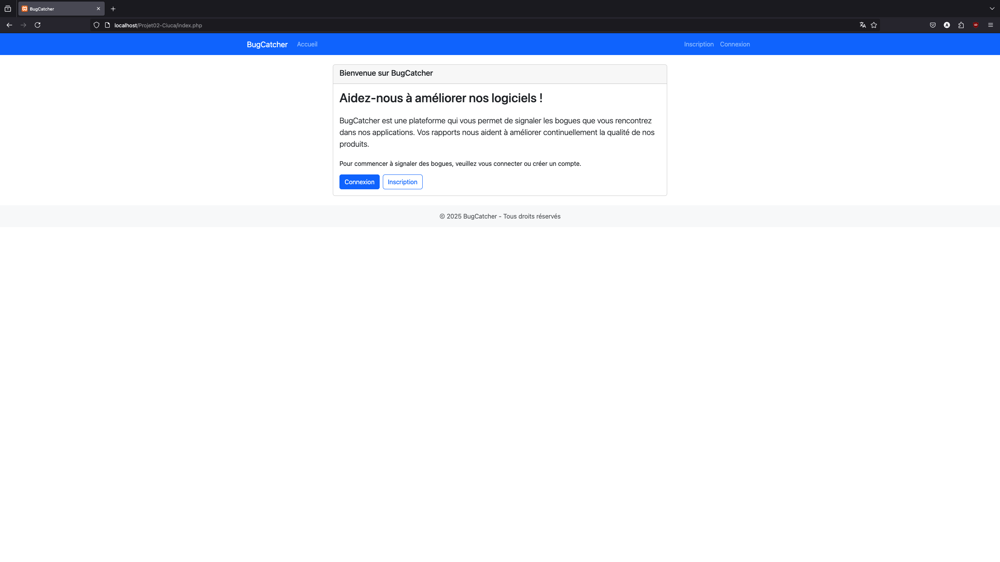
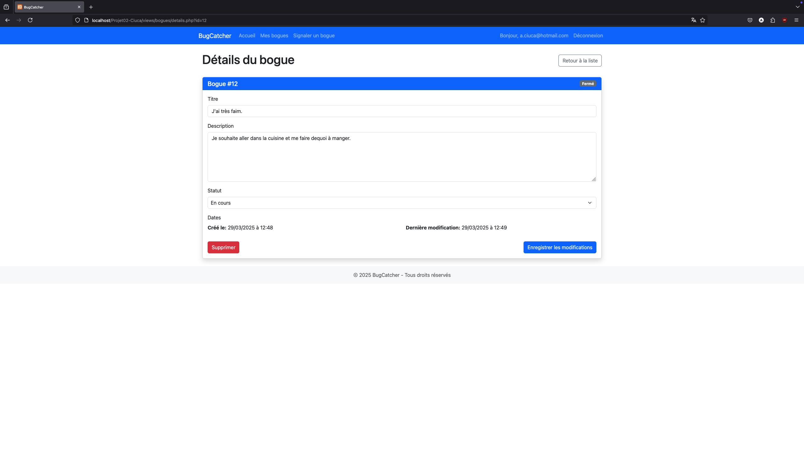
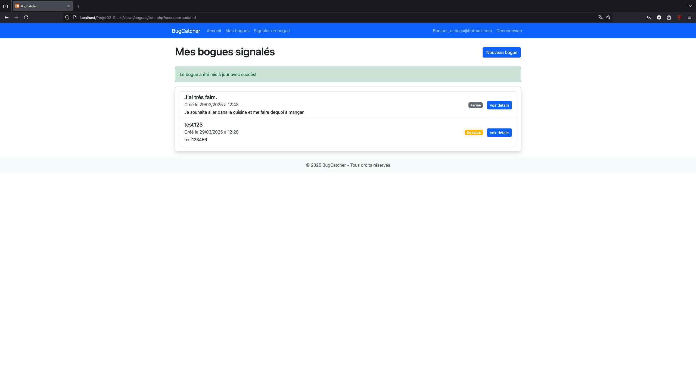

# BugCatcher

<!-- A FAIRE: Ajouter ici une brève description de l'application -->
BugCatcher est une application de gestion de bogues qui permet aux utilisateurs de signaler, suivre et résoudre des problèmes dans leurs projets. L'application permet aux utilisateurs de s'inscrire, de se connecter, de soumettre des bogues et de les mettre à jour en fonction de leur statut.
## Fonctionnalités
- **Inscription et connexion des utilisateurs** : Les utilisateurs peuvent s'inscrire et se connecter pour accéder à leurs informations personnelles et à la gestion de leurs bogues.
- **Gestion des bogues** : Les utilisateurs peuvent créer de nouveaux bogues, visualiser les bogues existants, et les mettre à jour (par exemple, changer le statut du bogue).
- **Gestion des statuts** : Les bogues sont associés à des statuts, permettant de suivre leur progression (par exemple, "En cours", "Résolu").
- **Historique des modifications** : Chaque bogue conserve un historique des modifications, y compris les dates de création et de modification.
<!-- A FAIRE: Lister ici les principales fonctionnalités de l'application (inscription, connexion, gestion des bogues, etc.) -->


<!-- A FAIRE: Décrire ici les étapes d'installation du projet:
1. Comment cloner/télécharger le projet
2. Comment configurer la base de données
3. Comment configurer les paramètres de connexion
4. Comment accéder à l'application
-->
0. **Note importante**:
    - Il faut utiliser une application cross-platforme comme Wamp Server ou Xampp (pour MacOS)
    - Cette application permet d'avoir un mini web serveur localement pour avoir accès aux services Apache, MySQL et phpmyadmin.
1. **Cloner le projet** :
   - Clonez ce projet en utilisant la commande Git suivante :
     ```bash
     git clone https://github.com/alexandru356/BugCatcher.git
     ```

2. **Configurer la base de données** :
   - Créez une base de données MySQL (ou autre selon votre configuration).
   - Importez le schéma de la base de données inclus dans le dossier `sql` du projet.

3. **Configurer les paramètres de connexion** :
   - Modifiez les paramètres de connexion à la base de données dans le fichier `config.php`. Assurez-vous que les informations de la base de données (utilisateur, mot de passe, hôte, etc.) sont correctes.

4. **Accéder à l'application** :
   - Une fois le projet installé, ouvrez-le dans votre navigateur. L'application sera accessible localement via `http://localhost/bugcatcher/` ou via le serveur web de votre choix.

## Structure du projet

<!-- A FAIRE: Décrire ici l'organisation des dossiers et fichiers principaux de votre projet -->
/includes
    -Config.php # Paramètres de connexion à la base de données
    -init.php # L'initialisation de l'application
/assets
    -images #images 
    -css #Feuilles de style CSS
/lib 
    -fonctions.php #fonctions utilisés
    -requetes.php #requetes de la DB
/views
    /bogues
        --Les vues pour les bogues
    /enregistrement
        --Les vues pour les enregistrements
    /partials
        --Les vues partiales comme l'en-tête, la navigation et le pied de page


## Technologies utilisées

<!-- A FAIRE: Lister ici les technologies, langages et frameworks utilisés pour le projet -->
- **PHP** : Langage de programmation principal pour la logique serveur.
- **MySQL/MariaDB** : Système de gestion de base de données relationnelle pour stocker les utilisateurs et les bogues.
- **HTML/CSS/BootStrap** : Technologies utilisées pour structurer et styliser les pages web.
- **PDO (PHP Data Objects)** : Utilisé pour interagir avec la base de données de manière sécurisée.
## Captures d'écran

<!-- A FAIRE: Ajouter ici quelques captures d'écran des principales pages de l'application -->
- Page d'accueil : 
- Page de gestion des bogues : 
- Page des détails d'un bogue : 
## Auteur

<!-- A FAIRE: Ajouter votre nom et matricule -->
- **Nom** : Alexandru Ciuca
- **Matricule** : 2378501
## Notes de développement
- **Améliorations futures** : Il serait bénéfique d'ajouter un système de notification pour avertir les utilisateurs lorsque le statut d'un bogue change ou lorsqu'un bogue leur est attribué.
<!-- A FAIRE: Ajouter ici des notes sur les choix de conception, les difficultés rencontrées ou les améliorations futures -->